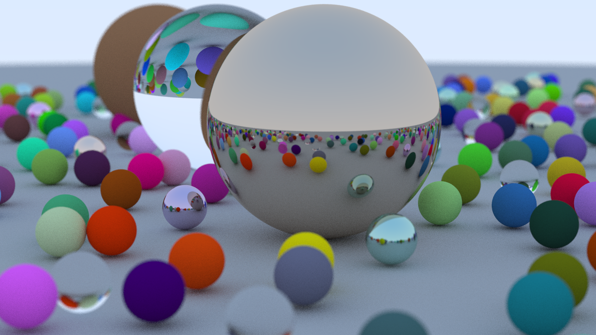

# python-ray-tracing-with-cuda-example
An example of cuda ray tracing in pure python syntax. It reproduces the result of [Ray Tracing in One Weekend](https://raytracing.github.io/books/RayTracingInOneWeekend.html)

The original cpp code takes around 4 hours to complete, while this python CUDA implementation takes less than 1 minute.

**NOTE**: The code is not guaranteed to be fully optimized, but I intend to provide some insights on efficient python ray tracing implementation.

**ATTENTION**: Currently it consumes ~16G of memory, so be aware if your PC doesn't have enough memory. You can decrease `SAMPLES_PER_RAY` to reduce memory consumption.



```
scene has 485 objs, takes 0.0107 s to construct
rendering time: 47.7054 s
saving to test.png ...
```

# Installation

## Requirements

Ubuntu with NVIDIA GPU (tested on RTX 2080Ti)

```
conda install numba matplotlib
```

## Run

```
python demo.py
```
